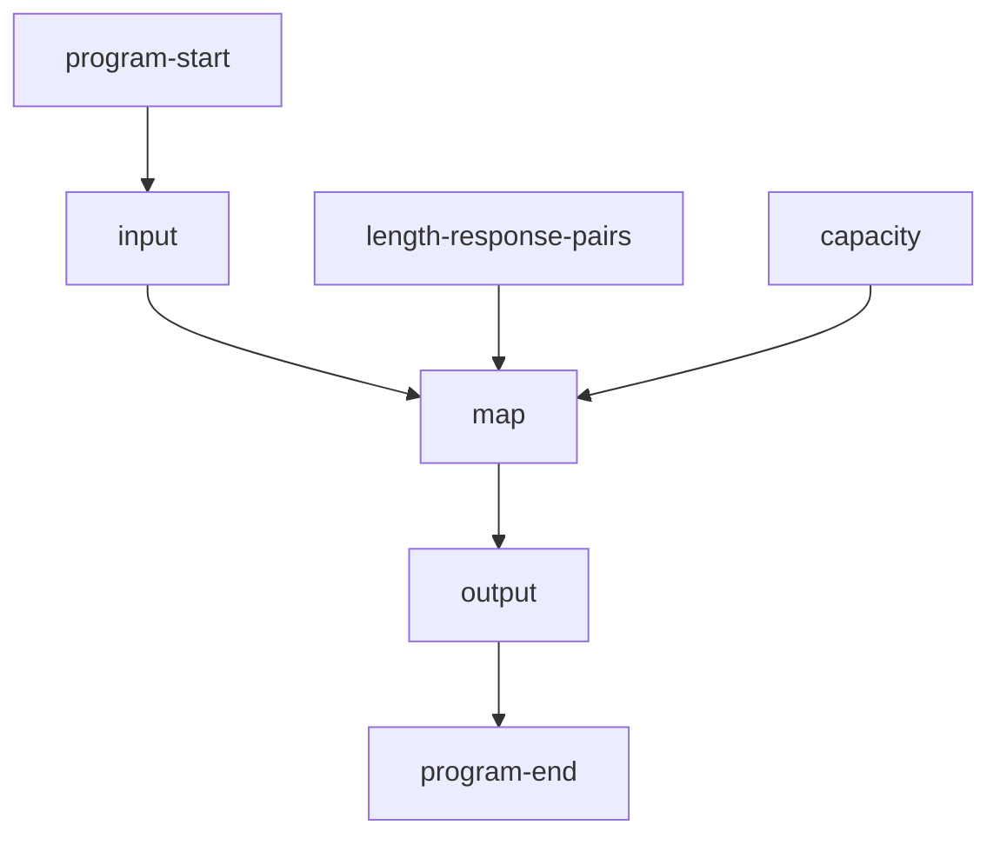

# flow chart

```mermaid
flowchart TD
program-start --> input --> map --> output --> program-end 
length-response-pairs --> map
capacity --> map
```

# length-response-pairs
Describe which sequ                     ence length will have which effect.
# capacity
