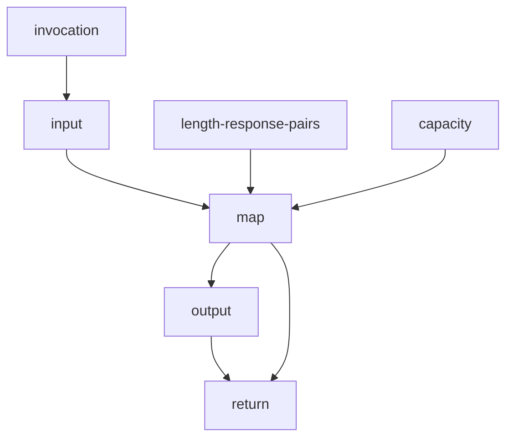

# process order

# length-response-pairs
Describe effects and the causing sequence. Currently, the effects are to clear the sequence and to sand the last values in it (the length is the same as the causing condition).
# capacity
The amount of stored values.
# input
A value.
# output
The sequence.