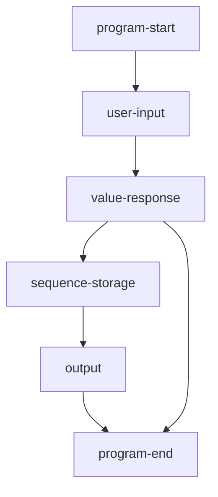

# flow chart

# user-input
Abstract any supported input method to a function without parameters. 
# value-response
Maps a given value to a response.
# sequence-storage
Remember inputs by order.
# output
The user's input or the ordered-set

# value -> response map
