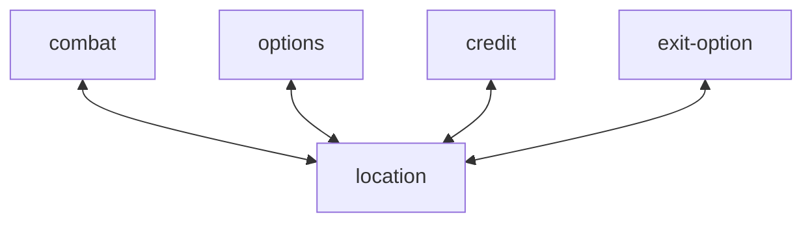

# mods
Each mod is a state that changes the behaviour of the game and the responses to user input. Any sheard memory between them has to be expressed.
Associated with identity-display and required-sequences that will becomes relevant in the transition.
# transitions

## combat
The experience that provided in combat-mod is the selling point of the game. 
## options
just settings
## credit
## exit-option
A pup up menu
## location
The main menu from that will inform players about encounters and lets them transition to other states.
# shared memory
display, options - visual settings
combat, location - player's hp, encounter
combat - next required sequence, current required sequence, incomplete sequence
every mod, white list - important inputs