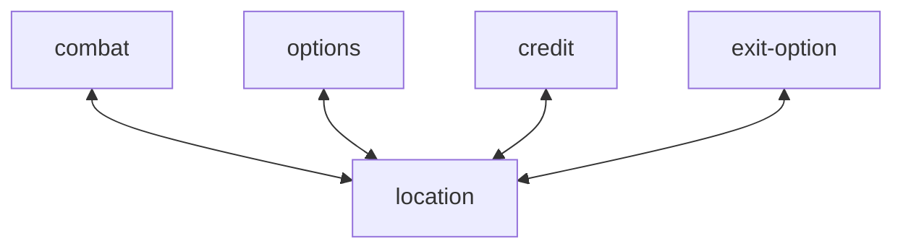

# mods
Each mod is a state that changes the behavior of the game and the responses to user input. Any shard memory between them has to be expressed.
Associated with identity-display and required-sequences that will becomes relevant in the transition.
# transitions

## location
The main menu from that will inform players about encounters and lets them transition to other states.
## combat
The experience that provided in combat-mod is the selling point of the game. 
## options
just settings
## credit
## exit-option
A pup up menu
# relations
visual settings: option's state, every mod transition reads
player's hp: combat's state, location transition reads
encounter: location writes, combat reads
next required sequence, current required sequence: combat's state
wanted sequence kind: every mod transition writes, white list reads
wanted sequence: white list writes, every mod reads