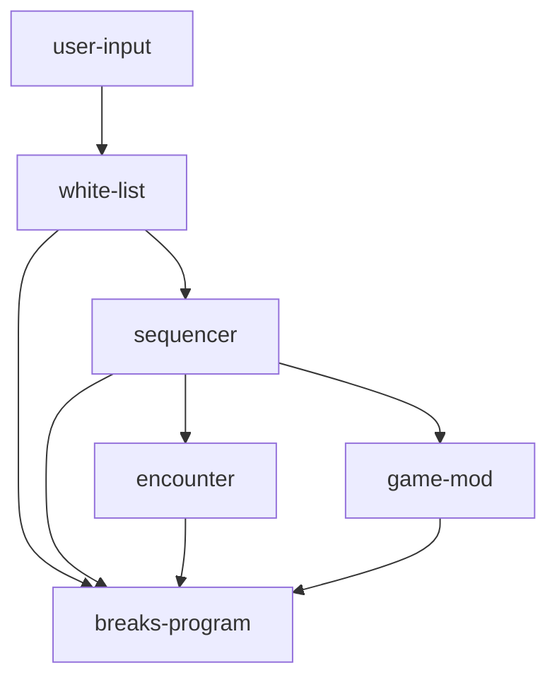

# administrator
input
sequencer
game mod
white list< input >
white list< input >, input -> maybe< input >
sequencer , input -> sequence
game mod , sequence -> game mod
# description

Any __user input__ will be sand to the __white list__. Input that is "in the list" to the __sequencer__. Ones the __sequencer__ stores a "wanted sequence", said sequence will be sanded to the "wanting targets". In Combat Mod, __encounter__ will always be added as the final wanting target. 
