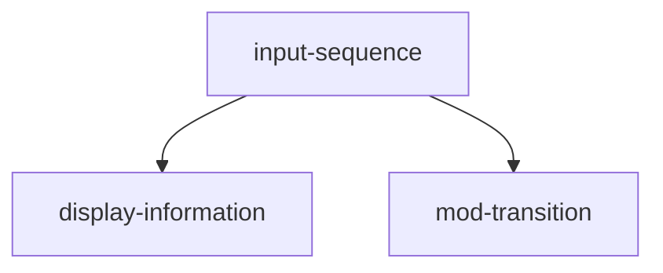

# types
Input
sequence
# functionality
read input: () -> input
# bureaucracy
read sequence: (input, state) -> sequence
# description
Consciences are caused by input, display is independent from it
## process order

# input-sequence
Waiting for a sequence of user inputs.
# mod-transition
Defines identity-display and input-sequence-events.
# display
Users are informed with the display.