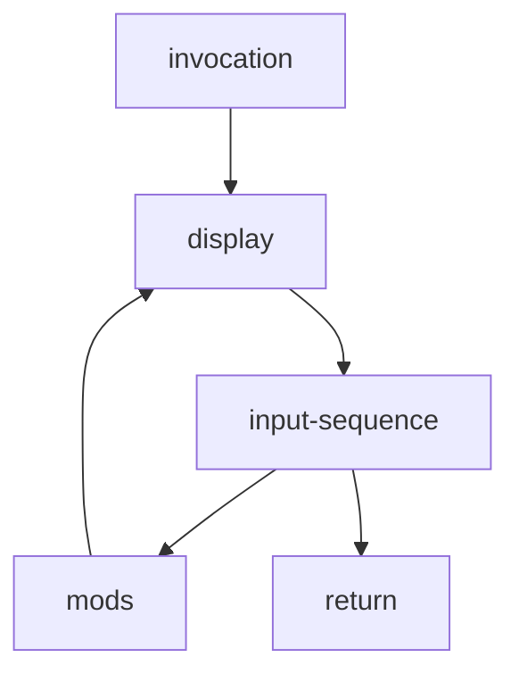

## process order

# input-sequence
The game response to user input and can acknowledge past inputs in the response.
# mods
The game's responses and actions are dependent on it's state.
# display
Users are informed with the display.
