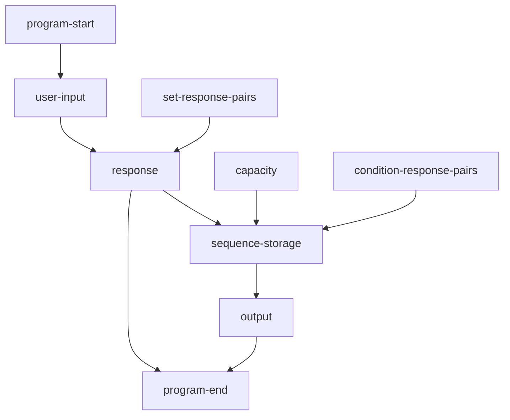
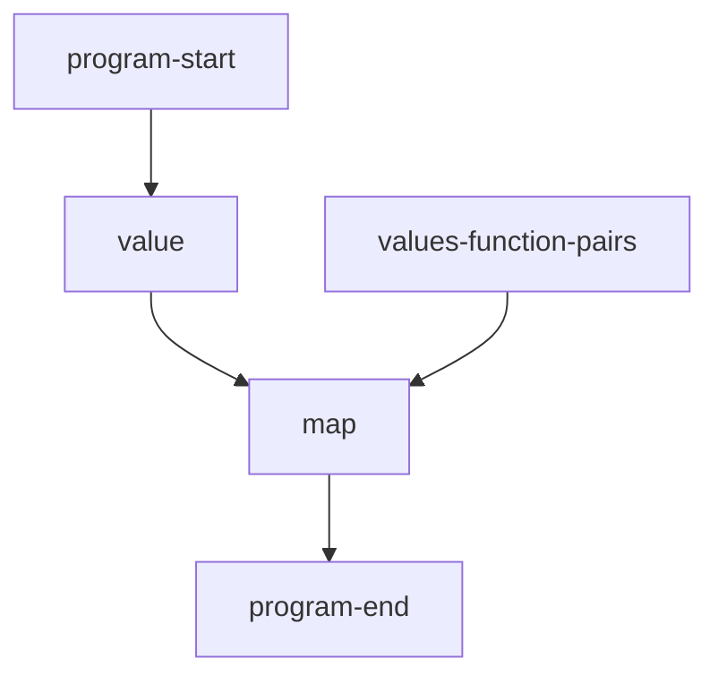
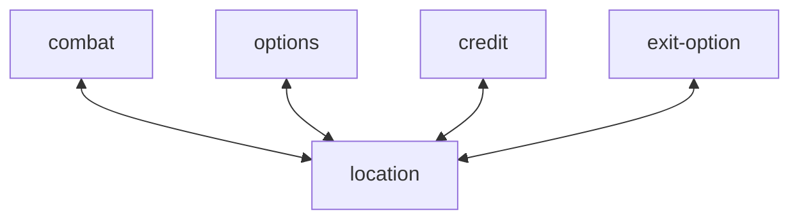

# flow chart

# user-input
Abstract any supported input method to a function without parameters.
# response
Maps a given value to a response.
# set-response-pairs
Pairs the values to responses.
# sequence-storage
# condition-response-pairs
Defines the effect of inputs.
# output
The user's input or the ordered-set

# value -> response map
## flow chart

## reasoning
The standard's users can ignore unwanted inputs.

# mods
## flow chart

State transitions are caused be output-received.