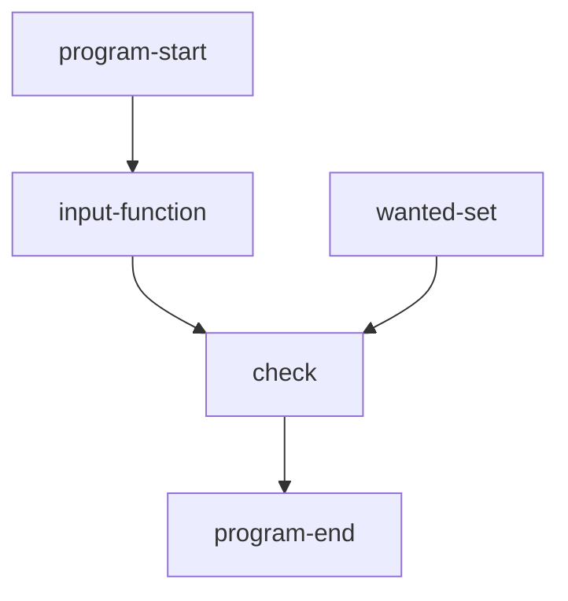

# flow chart

```mermaid
flowchart TD
program-start --> input-function --> check --> program-end 
wanted-set --> check
```
# reasoning
The standard's users can ignore unwanted inputs.
# comments
# iteration
## 1

```mermaid
flowchart TD
program-start --> input-function --> check --> program-end 
wanted-set --> check
```
