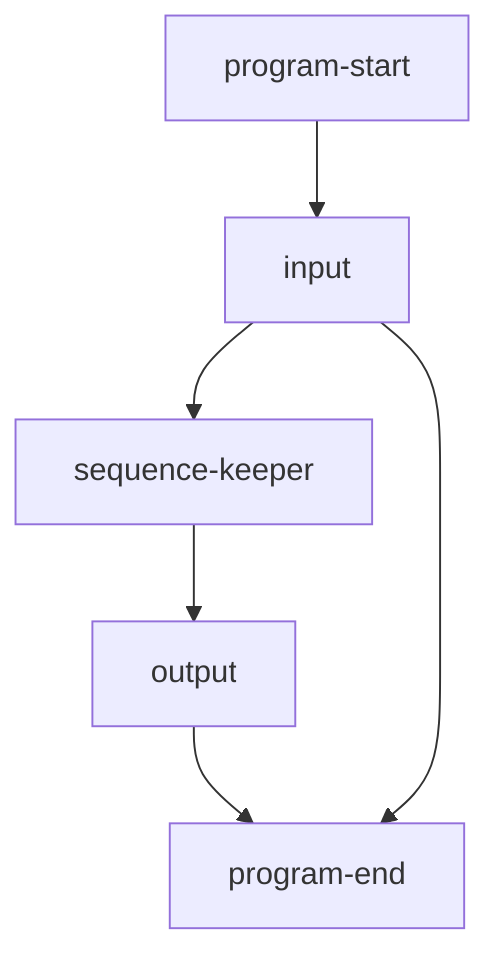
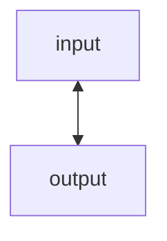
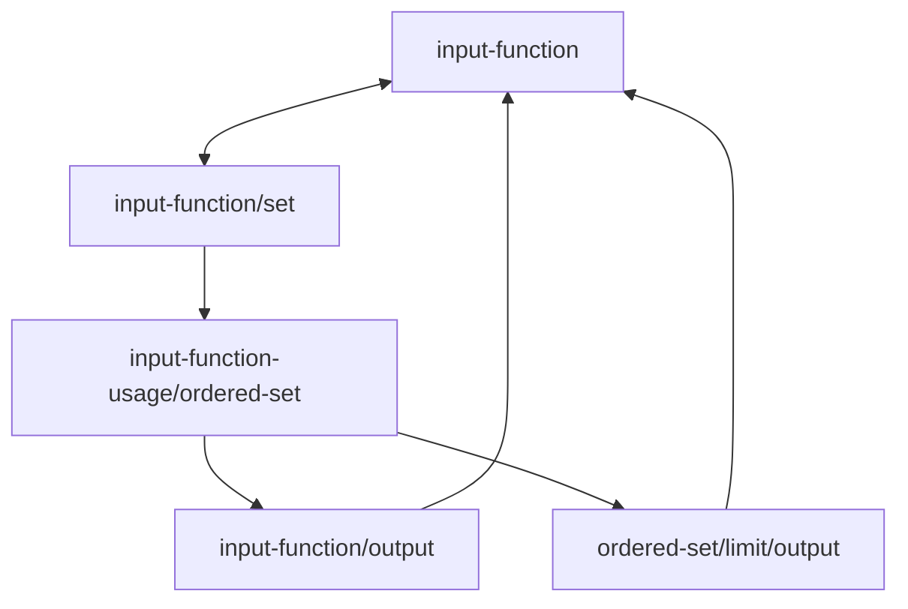
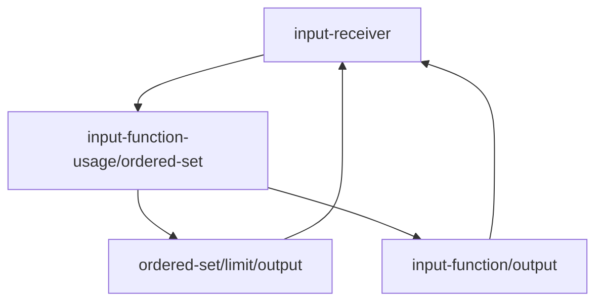
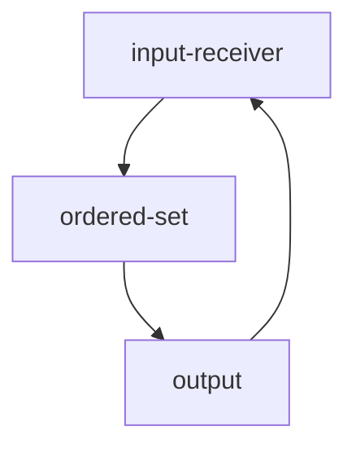
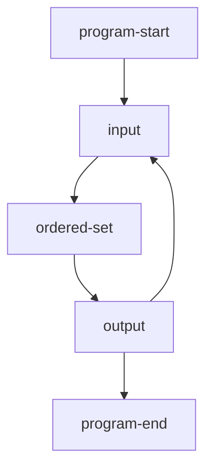
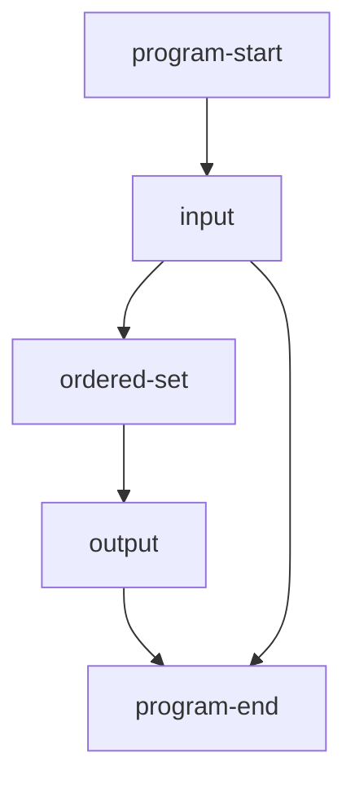
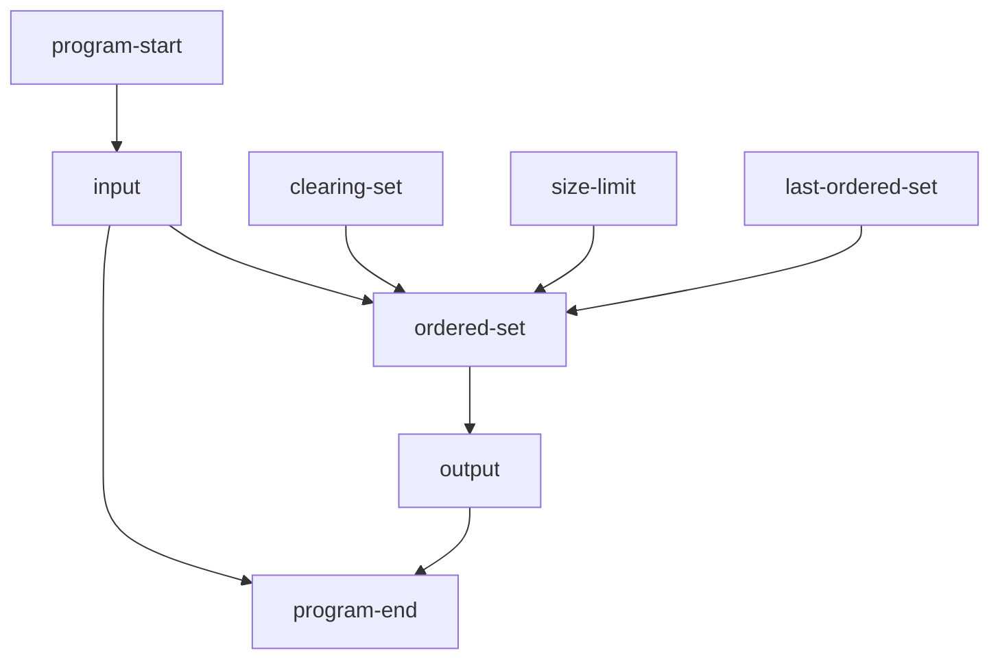

# flow chart

# reasoning
The standard's uses an input function, sequence descriptions, and a value white list
to return values that

The standard's implementors can produce values that can guarantee:
A sequence of given values 
Only 
# comments
## ordered-set
Keep inputs then sand them.
When a limit is reached, sand itself instead, then clear itself.
Certain input will make an early clear.
## output
The user's input or the ordered-set
# iterations
## 1

## 2

## 3

## 4

## 5

## 6

## 7

## 8

