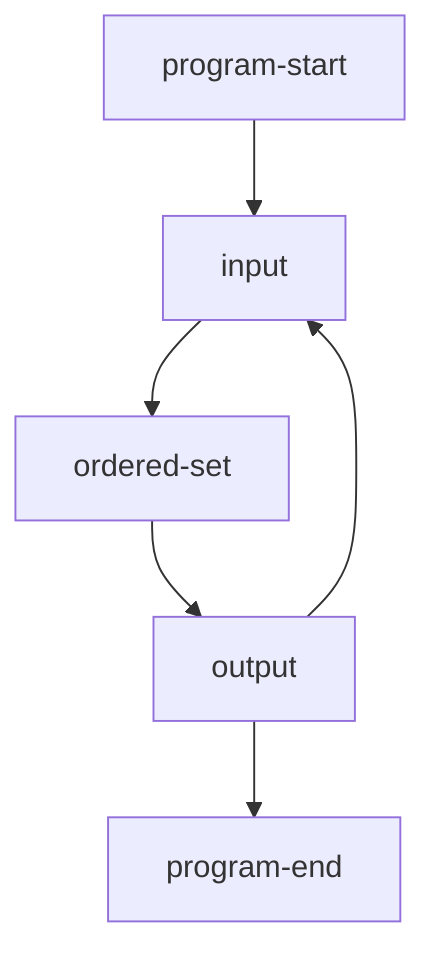
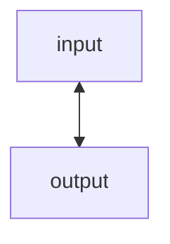
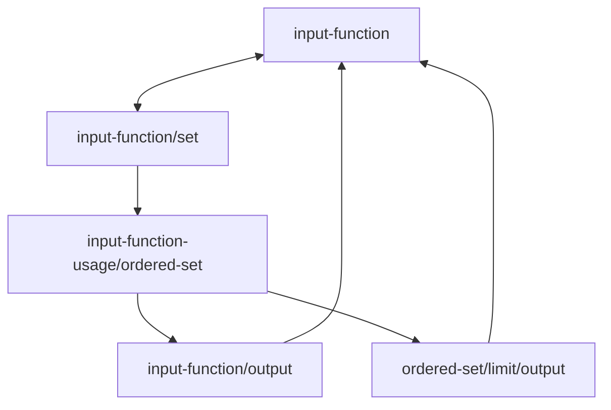
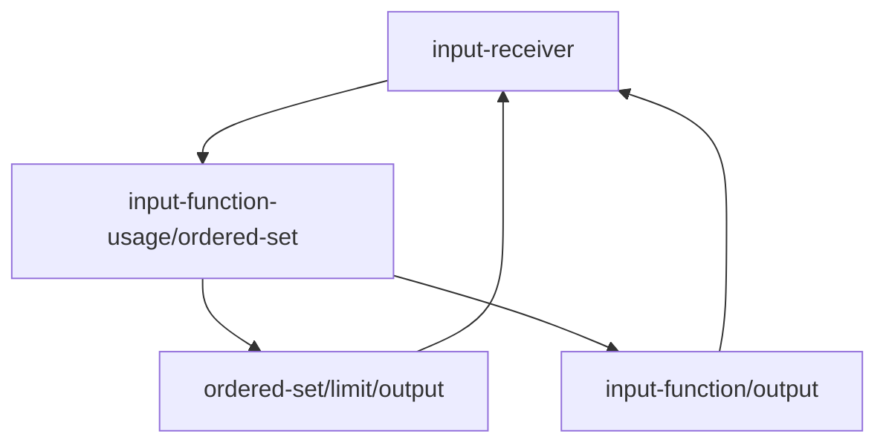
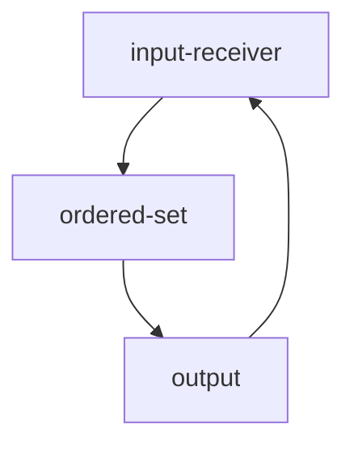

# flow chart

# reasoning
The standard's users can response to sequences of unique inputs.
# comments
## ordered-set
Keep inputs.
Sand them as output.
When a limit is reached, sand itself as output instead, then clear itself.
Certain input will make an early clear.
## output
The user's input or the ordered-set
# iterations
## 1

## 2

## 3

## 4

