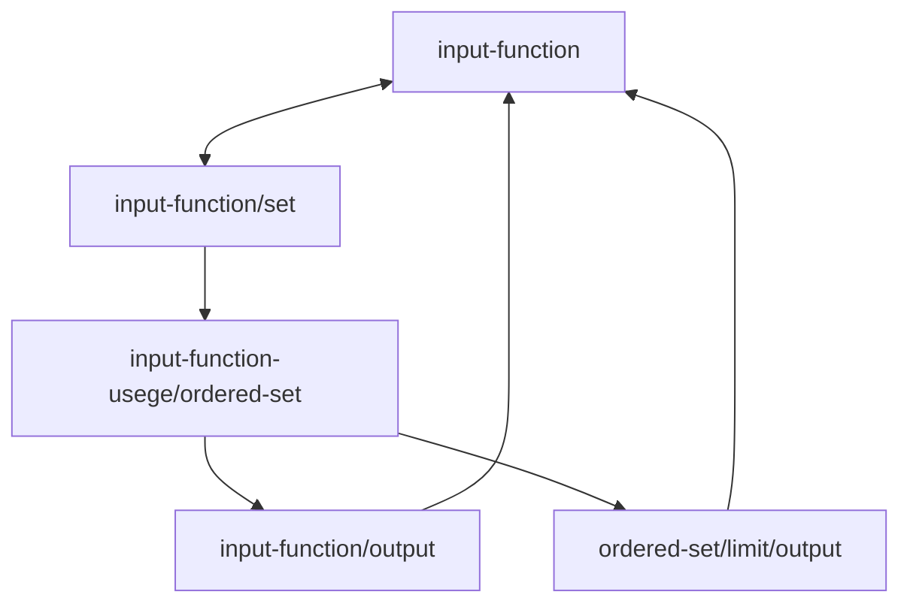
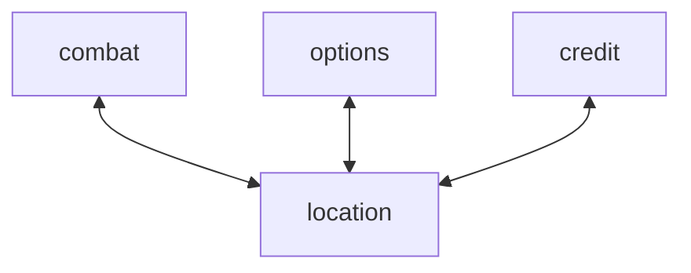

# input processing

```mermaid
flowchart TD
    input-function <--> input-function/set --> input-function-usege/ordered-set --> input-function/output --> input-function
    input-function-usege/ordered-set --> ordered-set/limit/output --> input-function
```
# mods

```mermaid
flowchart TD
    combat <--> location
    options <--> location
    credit <--> location
```
State transitions are caused be output-received.